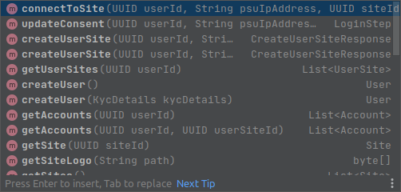

# Java SDK for YTS

Yolt Technology Services (YTS) is a service that provides access to PSD2 APIs of European banks through a single easy to use
API enabling use cases like personal financial management, credit scoring, one-off payments, recurring payments, 
debt collection, instant lending and others.

Read the docs at https://developer.yolt.com/docs. 

This Java SDK is a personal project that further simplifies connecting to YTS API. 
This SDK is not an official YTS product and comes without YTS support or guarantees. 
Please direct any questions you may have at me directly.

### Setting up the SDK
The SDK needs the following information to be able to work with YTS API.

- The base URL of the YTS API, either for the sandbox or production
- The TLS client certificate used to set up an mTLS connection with YTS
- The signing key used to sign token requests

Below is an example of how the YTS SDK can be set up in a Spring environment.

```java
    @Bean
    public YTS ytsClient(EnvironmentClient environmentClient) {
        // Http client settings
        HttpClientConfig httpClientConfig = new HttpClientConfig.Builder("The base URL of the YTS sandbox or the production environment here")
                .setKeyStore("TLS keystore on the classpath", "keystore passwords")
                .setTimeouts(3000, 3000)
                .setLogRequestsResponses(true) // enables full request/response logging, so be mindful of logging sensitive data on prd environments
                .build();

        // Signing settings - used for signing the token request for YTS. See https://developer.yolt.com/docs/getting-started#connect-to-yts
        AccessTokenConfig signingConfig = new AccessTokenConfig(
                appProperties.getSigningKeyStore(), // keystore on the classpath
                appProperties.getSigningKeyStorePw(), // keystore password
                appProperties.getSigningKeyAlias(),  // key alias
                environmentClient.getClient().getYtsSignatureVerificationKeyId()); // The id under which the public verification key is known by YTS (Check in the dev portal)

        return new YTS(appProperties.getClientId(),
                signingConfig,
                httpClientConfig);
    }
```
The `YTS` class is the single point of entry for all API calls. 




### Request and response logging
Http calls to YTS are made with Spring WebClient that is configured with Jetty Http Client.
Clients can enable request and response logging by setting `HttpClientConfig.logRequestsResponses` to `true`.

This JDK uses Jetty HTTP client under the surface. Jetty is an easy to configure HTTP client that allows logging of full
request and response body and headers, which helps when debugging potential issues.

### Token fetching
The SDK takes care of fetching tokens internally, so clients don't have to request and track access tokens when using 
this SDK. The default strategy the SDK uses for fetching access tokens from YTS is `SlightlyLazyAccessTokenStrategy`. 
This strategy loads a token whenever there is no existing token, or the existing token is more than 9 minutes old. 
It is slightly lazy in the sense that it will only get a new token when a client makes a request.

A more elegant implementation of the `AccessTokenStrategy` could fetch a token in a background thread. However, implementers
must make sure that such a process is robust and can recover from potential problems such as downtime or HTTP errors.

### Scraping and embedded flow
Embedded flow where the user provides credentials via the client app frontend is currently not yet supported in this SDK. 
This doesn't mean there are no forms at all. For banks like Credit Agricole, Banque Populaire and Caisse d'Epargne YTS 
implemented a region selection form. These are supported by the `SelectField` class, so these banks are supported
via the SDK.

If an embedded flow must be supported, the following changes should be implemented:
- Richer form domain in order to support the `container` form component and additional form fields (text, date, number, radio, etc)
- Encryption instructions and a public key on the form step for supporting encryption of credentials
- A call to the `/vx/connect` endpoint without `redirectUrlId` parameter should be supported


